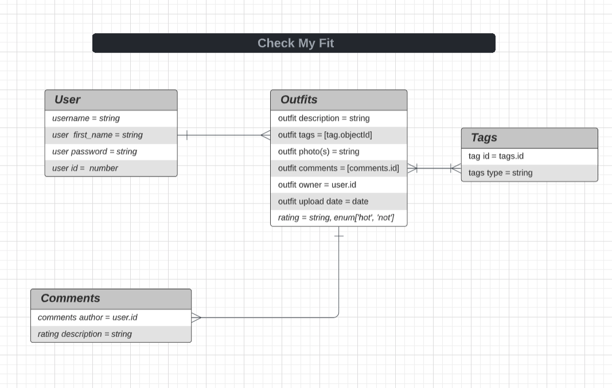

# check-my-fit
- an app to share and comment on outfits
- here hosts the RESTful routes to be displayed through: https://github.com/steviemilitello/check-my-fit-client

# ERD

# Installation Instructions:
1. fork & clone this repo
2. run `npm install` to install dependecies.
3. run `npm run seed` to seed the data.

# Tech Used: 
- Node.js
- Mongoose
- Mongodb

